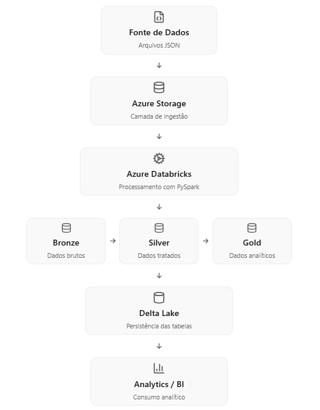

# Data Engineering Pipeline com Azure, Databricks e PySpark

## Objetivo

Este projeto demonstra a construção de um pipeline de Engenharia de Dados utilizando Azure, Databricks e PySpark seguindo a arquitetura Medallion.

---

## Arquitetura da Solução

O pipeline realiza a ingestão de arquivos JSON, processa os dados utilizando PySpark no Azure Databricks e persiste cada etapa em Delta Lake seguindo a arquitetura Medallion.

---

## Tecnologias

* Azure
* Azure Databricks
* Python
* PySpark
* Delta Lake

---

## Estrutura do Projeto

anac_databricks/
│
├── anac/
│   ├── resource/
│   │   └── origem/              # Arquivos JSON de origem
│   │
│   ├── bronze/                  # Dados brutos
│   │
│   ├── silver/                  # Dados tratados
│   │
│   ├── gold/                    # Dados analíticos
│   │
│   ├── params/
│   │   └── global_config/       # Configurações reutilizáveis
│   │
│   └── notebooks/               # Notebooks Databricks
│
├── docs/
│   └── arquitetura.png          # Diagrama da arquitetura
│
└── README.md

A estrutura foi organizada seguindo o padrão da arquitetura Medallion, separando as camadas de ingestão, transformação e disponibilização dos dados, além de manter configurações reutilizáveis e documentação do projeto.

---

## Fonte dos Dados

Os dados utilizados neste projeto são provenientes do portal de **Dados Abertos da Agência Nacional de Aviação Civil (ANAC)**, disponibilizados para uso público com o objetivo de promover transparência e incentivar análises sobre segurança operacional da aviação civil brasileira.

**Conjunto de dados:** Ocorrências Aeronáuticas

**Fonte oficial:** https://sistemas.anac.gov.br/dadosabertos/Seguranca%20Operacional/Ocorrencia/

Os arquivos são disponibilizados no formato JSON e utilizados como fonte de ingestão para o pipeline implementado neste projeto.

---
